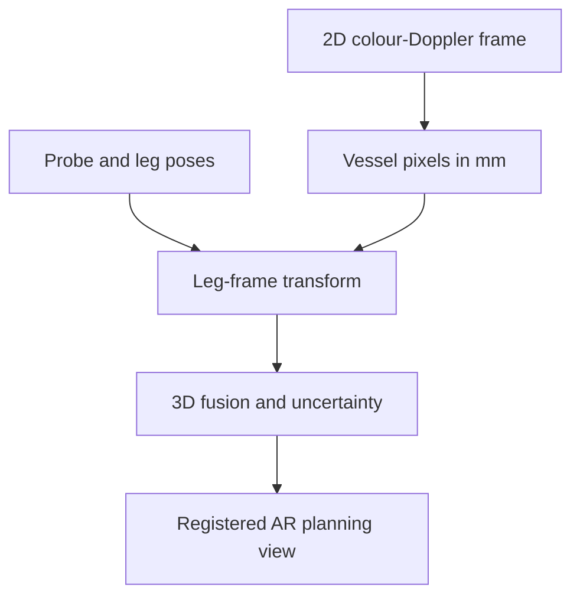

# PerforaAR

[](https://github.com/eyasudesalegne/PerforaAR/actions/workflows/ci.yml)

**PerforaAR** is an open research prototype for non-invasive three-dimensional perforator mapping and augmented-reality guidance in anterolateral thigh (ALT) flap planning.

The project turns spatially tracked Doppler observations into a fused, ranked map of candidate perforators, then provides the geometry needed to align that map with a camera view. The first public milestone deliberately uses synthetic data so the software can be tested without exposing personal or clinical data.

> **Research use only.** PerforaAR is not a medical device, has not been clinically validated, and must not be used to diagnose, select a vessel, or guide patient care.

## Why this project exists

Handheld Doppler is useful but produces isolated observations that must be remembered or marked manually. PerforaAR investigates whether tracked sweeps can preserve those observations as a spatial map, combine repeated detections, rank candidates transparently, and relocate the map after repositioning. The benefit is a research hypothesis to be measured against existing practice—not an assumed clinical claim.

## Current public milestone: M0

- deterministic synthetic Doppler detections;
- spatial fusion of repeat detections;
- explainable candidate scoring;
- interactive Streamlit planning-map demo;
- rigid registration and camera-projection geometry;
- automated tests and GitHub Actions;
- staged phantom, healthy-volunteer, and clinician-usability validation plan.

Real-time Doppler acquisition, learned vessel segmentation, deformable registration, and a surgical AR interface are planned modules and are not represented as complete.

## Selected engineering route

PerforaAR will use a conventional **2D colour-Doppler probe with optical tracking**. A
rigid target on the probe records each image plane, while a second rigid reference on
the thigh records subject motion. The reconstruction is mathematical: calibrated vessel
points from successive frames are transformed into the leg-reference frame and fused.
AI may later segment vessel pixels, but it does not invent the 3D anatomy.

For each usable frame, the acquisition contract requires:

`Doppler frame + frame timestamp + probe pose + leg-reference pose + calibration ID`

Tracking the probe alone is insufficient when the leg can move. See the
[tracked acquisition specification](docs/tracked-acquisition-spec.md).

## System concept



## Quick start

Requires Python 3.10 or newer.

```bash
python -m venv .venv
source .venv/bin/activate  # Windows: .venv\Scripts\activate
python -m pip install -e ".[dev,demo]"
pytest
streamlit run app.py
```

To run the pipeline without the web interface:

```bash
python scripts/run_demo.py --input data/sample/synthetic_detections.csv --output outputs/ranked_candidates.csv
```

## Repository map

| Path | Purpose |
|---|---|
| `src/perforaar/` | Tested fusion, scoring, geometry, and synthetic-data modules |
| `app.py` | Interactive research demo |
| `configs/` | Versioned, human-readable pipeline settings |
| `data/` | Acquisition/calibration schemas and synthetic sample only |
| `docs/` | Scope, architecture, hardware, data governance, and validation plan |
| `tests/` | Unit tests for quantitative core functions |

## Evidence and scope

Published studies support investigating AR for perforator mapping, while also showing the need for better validation and workflow assessment. PerforaAR therefore separates engineering performance from clinical claims and uses predefined metrics. See [Scientific basis](docs/scientific-basis.md) and [Validation plan](docs/validation-plan.md).

## Intended TÜSEB B3 contribution

The proposed B3 output is a tracked 2D-Doppler engineering pre-prototype demonstrated
first on synthetic geometry and a vascular phantom. Non-invasive healthy-volunteer
feasibility begins only after institutional ethics approval. Simulation, transferred
data, phantom measurements, and participant measurements are reported separately; none
is presented as clinical validation. Intraoperative use and medical-device claims are
outside the present milestone.

## Contributing and citation

See [CONTRIBUTING.md](CONTRIBUTING.md). If you use this repository in research, cite the software metadata in [CITATION.cff](CITATION.cff). The source is available under the Apache License 2.0; third-party datasets, models, and anatomical assets retain their own licenses.
