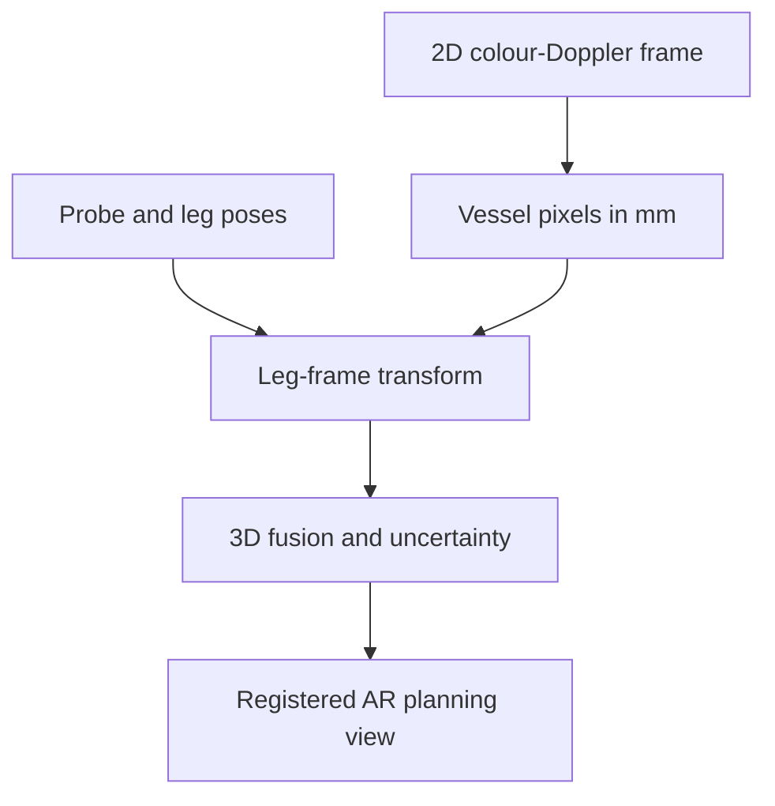

# PerforaAR

[](https://github.com/eyasudesalegne/PerforaAR/actions/workflows/ci.yml)

**PerforaAR** is an open research prototype for non-invasive three-dimensional perforator mapping and augmented-reality guidance in anterolateral thigh (ALT) flap planning.

The project turns spatially tracked Doppler observations into a fused, ranked map of candidate perforators, then provides the geometry needed to align that map with a camera view. The first public milestone deliberately uses synthetic data so the software can be tested without exposing personal or clinical data.

> **Research use only.** PerforaAR is not a medical device, has not been clinically validated, and must not be used to diagnose, select a vessel, or guide patient care.

## Why this project exists

Handheld Doppler is useful but produces isolated observations that must be remembered or marked manually. PerforaAR investigates whether tracked sweeps can preserve those observations as a spatial map, combine repeated detections, rank candidates transparently, and relocate the map after repositioning. The benefit is a research hypothesis to be measured against existing practice—not an assumed clinical claim.

## Current public milestone: M0 + THY3 software experiment

- deterministic synthetic Doppler detections;
- spatial fusion of repeat detections;
- explainable candidate scoring;
- interactive Streamlit planning-map demo;
- rigid registration and camera-projection geometry;
- automated tests and GitHub Actions;
- a reproducible public-data test that re-slices real 3D colour/power Doppler volumes,
  replays them as virtually tracked 2D frames, and measures 3D reconstruction fidelity;
- staged phantom, healthy-volunteer, and clinician-usability validation plan.

Real-time Doppler acquisition, learned vessel segmentation, deformable registration, and a surgical AR interface are planned modules and are not represented as complete.

## Selected engineering route

PerforaAR will use a conventional **2D colour-Doppler probe with optical tracking**. A
rigid target on the probe records each image plane, while a second rigid reference on
the thigh records subject motion. The reconstruction is mathematical: calibrated vessel
points from successive frames are transformed into the leg-reference frame and fused.
AI may later segment vessel pixels, but it does not invent the 3D anatomy.

For each usable frame, the acquisition contract requires:

`Doppler frame + frame timestamp + probe pose + leg-reference pose + calibration ID`

Tracking the probe alone is insufficient when the leg can move. See the
[tracked acquisition specification](docs/tracked-acquisition-spec.md).

## System concept


```mermaid
flowchart TD
    A["2D colour-Doppler frame"] --> B["Vessel pixels in mm"]
    C["Probe and leg poses"] --> D["Leg-frame transform"]
    B --> D
    D --> E["3D fusion and uncertainty"]
    E --> F["Registered AR planning view"]
```

## Quick start

Requires Python 3.10 or newer.

```bash
python -m venv .venv
source .venv/bin/activate  # Windows: .venv\Scripts\activate
python -m pip install -e ".[dev,demo]"
pytest
streamlit run app.py
```

To run the pipeline without the web interface:

```bash
python scripts/run_demo.py --input data/sample/synthetic_detections.csv --output outputs/ranked_candidates.csv
```

To reproduce the Dryad THY3 software-verification experiment:

```bash
python -m pip install -e ".[research]"
python scripts/prepare_dryad_cusi.py --archive /path/to/doi_10_5061_dryad_w0vt4b8z8__v20240117.zip
python scripts/run_dryad_thy3.py
```

The Dryad volumes are real mouse-brain colour/power Doppler data but are already 3D
reconstructions. PerforaAR therefore creates virtual tracked slices from them. This
validates transforms, compounding, sparse-plane interpolation, and frame-dropout
behavior; it does not replace validation with original tracked frames or a vascular
phantom. Raw and reconstructed NIfTI files remain outside Git, while the manifest,
metrics, figures, configuration, and provenance are versioned.

See the [Dryad THY3 experiment report](docs/experiments/dryad-thy3.md) and its
[machine-readable results](results/dryad_thy3/metrics.json).

## TUS-REC2024 tracked reconstruction experiment

The second public-data experiment uses real 2D ultrasound frames, measured probe
poses, and probe calibration from TUS-REC2024. All 72 frame/transform scan pairs passed
validation. Six representative scans were reconstructed as NIfTI volumes and evaluated
under 90 conditions covering frame-rate reduction, dropout, latency, pose noise,
rotation noise, and calibration perturbation. With valid-pixel masking and union-based
scoring, the worst raw-volume union NRMSE was `0.1267` under `2 mm` translation noise.

The source dataset is intentionally excluded from Git. Download the **TUS-REC2024
Validation Dataset** (subjects 050, 051, and 052) from
[Zenodo](https://doi.org/10.5281/zenodo.12979481). The source archive is
`Freehand_US_data_val.zip` (4,842,723,858 bytes; MD5
`487ebe3241678569296e47efeb2ea325`). Extract `frames/`, `transfs/`, `landmark/`,
`calib_matrix.csv`, and `dataset_keys.h5` into the repository root, then run:

```bash
python -m pip install -e ".[research]"
python scripts/prepare_tus_rec2024.py --root .
python scripts/run_tus_rec2024.py --root . --config configs/tus_rec2024.yaml
```

See the [TUS-REC2024 experiment report](docs/experiments/tus-rec2024.md), its
[machine-readable metrics](results/tus_rec2024/metrics.json),
[landmark evaluation](results/tus_rec2024/landmark_metrics.json), and
[performance benchmark](results/tus_rec2024/benchmark.json). The committed figures and
reconstructed volumes are in `results/tus_rec2024/`.

### Inspect the 3D reconstruction

The Streamlit application now includes an interactive **3D Reconstruction** page with
physical-coordinate volume rendering, orthogonal slices, acquisition QA, and GLB plus
coordinate-metadata export for a future Unity/OpenXR glasses client:

```bash
python -m pip install -e ".[demo]"
streamlit run app.py
```

The committed TUS-REC2024 results are grayscale B-mode anatomy, not colour-Doppler vessel
maps. They can validate the viewer and AR data contract, but a surgical vessel overlay
still requires tracked colour-Doppler acquisition, vessel segmentation, and
participant-specific registration. See the [3D viewer and AR scene contract](docs/ar-viewer.md)
and the [pre-generated 3D assets](results/tus_rec2024/ar_exports/).

### Turkish technical report

The illustrated Turkish report consolidates the software architecture, Dryad and
TUS-REC2024 experiments, all committed reconstruction diagnostics, the six 3D surface
variants, and the AR scene contract. Generate it with:

```bash
python scripts/generate_turkish_report.py
```

The PDF is written to `output/pdf/PerforaAR_Teknik_Raporu_TR.pdf`.

## Repository map

| Path | Purpose |
|---|---|
| `src/perforaar/` | Tested fusion, scoring, geometry, and synthetic-data modules |
| `app.py` | Interactive research demo |
| `configs/` | Versioned, human-readable pipeline settings |
| `data/` | Schemas, synthetic samples, and external-data manifests |
| `docs/` | Scope, architecture, hardware, data governance, and validation plan |
| `tests/` | Unit tests for quantitative core functions |
| `results/dryad_thy3/` | Versioned metrics and figures from the public-data test |
| `results/tus_rec2024/` | Tracked reconstruction metrics, figures, and NIfTI volumes |

## Evidence and scope

Published studies support investigating AR for perforator mapping, while also showing the need for better validation and workflow assessment. PerforaAR therefore separates engineering performance from clinical claims and uses predefined metrics. See [Scientific basis](docs/scientific-basis.md) and [Validation plan](docs/validation-plan.md).

## Intended TÜSEB B3 contribution

The proposed B3 output is a tracked 2D-Doppler engineering pre-prototype demonstrated
first on synthetic geometry and a vascular phantom. Non-invasive healthy-volunteer
feasibility begins only after institutional ethics approval. Simulation, transferred
data, phantom measurements, and participant measurements are reported separately; none
is presented as clinical validation. Intraoperative use and medical-device claims are
outside the present milestone.

## Contributing and citation

See [CONTRIBUTING.md](CONTRIBUTING.md). If you use this repository in research, cite the software metadata in [CITATION.cff](CITATION.cff). The source is available under the Apache License 2.0; third-party datasets, models, and anatomical assets retain their own licenses.
