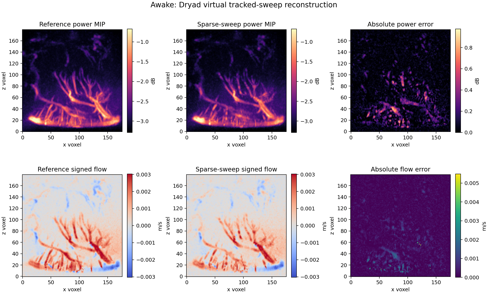
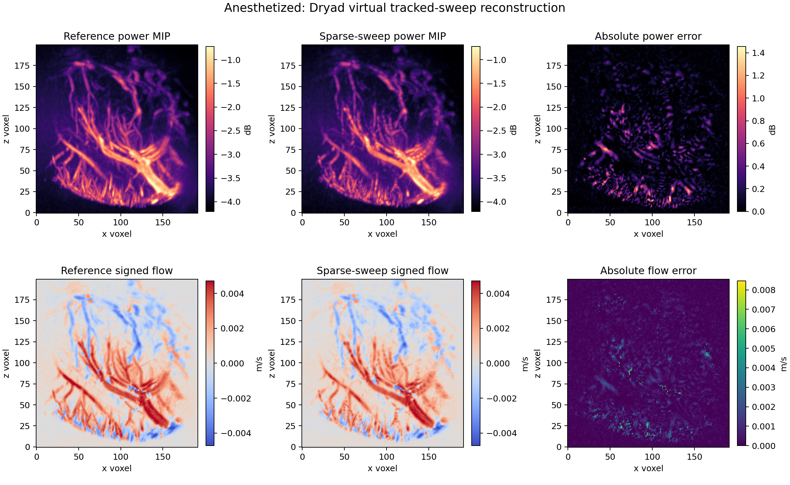

# Dryad THY3 tracked-slice reconstruction experiment

## Outcome

**PASS for the predefined Stage 0 software-verification criteria.** The exact tracked
plane replay was lossless in both volumes. With one plane every four voxels (160 μm
nominal separation), the awake and anesthetized reconstructions achieved vessel-mask
Dice scores of 0.8513 and 0.8343, surface Dice scores of 0.9732 and 0.9631, and signed
flow agreement of 98.49% and 98.63%.

This result supports the PerforaAR coordinate-transform, compounding, and interpolation
implementation. It does **not** establish accuracy from independently acquired 2D
ultrasound, optical-tracker accuracy, human perforator performance, or clinical utility.

## Source and provenance

- Dataset: *Four-Dimensional Computational Ultrasound Imaging of Brain Hemodynamics*
- Dryad DOI: <https://doi.org/10.5061/dryad.w0vt4b8z8>
- Coupled paper: <https://doi.org/10.1126/sciadv.adk7957>
- Dataset version: 2024-01-17
- License: CC0 1.0
- Inputs: awake/anesthetized colour Doppler and power Doppler NIfTI volumes
- Shapes: 176 × 156 × 180 and 192 × 240 × 200 voxels
- Documented resolution: 40 μm isotropic
- Channels: signed velocity in m/s and Doppler power in dB

Every input size and SHA-256 digest was checked against
[`data/external/dryad_cusi_manifest.json`](../../data/external/dryad_cusi_manifest.json).
Raw data and generated NIfTI volumes are ignored by Git.

## Important metadata finding

The dataset README states 40 μm isotropic sampling. The NIfTI `pixdim` fields contain
`4e-05` with undeclared units, which is compatible with 40 μm if interpreted as metres.
However, the active s-form has a diagonal scale of `0.025`, also with undeclared units.
Because those fields conflict, preprocessing preserves every float32 voxel value but
writes derived volumes with explicit 0.04 mm isotropic spacing and a zero origin. The
decision and original affine are recorded in
[`preprocessing.json`](../../results/dryad_thy3/preprocessing.json).

## Method

1. Load and validate each matched colour/power volume.
2. Define the top 1% of power values as the fixed reference vessel mask.
3. Extract x-z image planes and assign each a known `T_leg_from_image` pose along y.
4. Reconstruct power and signed velocity using nearest-voxel mean compounding.
5. Linearly interpolate between observed planes for sparse conditions.
6. Evaluate exact replay, every-fourth-plane sampling, and deterministic 20% internal
   frame dropout.
7. Measure vessel-mask Dice, surface Dice at two voxels, power error, velocity error,
   and sign agreement where reference |velocity| is at least 0.1 mm/s.

The frozen configuration and acceptance limits are in
[`configs/dryad_thy3.yaml`](../../configs/dryad_thy3.yaml).

## Results

| Dataset | Condition | Frames | Observed coverage | Dice | Surface Dice | Flow sign agreement |
|---|---:|---:|---:|---:|---:|---:|
| Awake | Exact | 156 | 100.0% | 1.0000 | 1.0000 | 100.00% |
| Awake | Sparse, 160 μm | 40 | 25.6% | 0.8513 | 0.9732 | 98.49% |
| Awake | Sparse + 20% dropout | 33 | 21.2% | 0.7080 | 0.8392 | 93.69% |
| Anesthetized | Exact | 240 | 100.0% | 1.0000 | 1.0000 | 100.00% |
| Anesthetized | Sparse, 160 μm | 61 | 25.4% | 0.8343 | 0.9631 | 98.63% |
| Anesthetized | Sparse + 20% dropout | 50 | 20.8% | 0.7253 | 0.8577 | 95.01% |

The dropout criterion is robustness relative to the sparse baseline: Dice loss must be
at most 0.20. Loss was 0.1433 awake and 0.1090 anesthetized, so both passed this specific
stress criterion even though dropout Dice was below the separate sparse-baseline target.

## Visual review

The power maximum-intensity projections retain the main vascular trunks and much of the
fine branching structure. The signed-flow projections retain the red/blue direction
pattern. Errors concentrate around thin vessel boundaries and small branches, as
expected from 160 μm inter-plane sampling and linear interpolation.





## Reproduce

```bash
python -m pip install -e ".[research]"
python scripts/prepare_dryad_cusi.py \
  --archive /path/to/doi_10_5061_dryad_w0vt4b8z8__v20240117.zip
python scripts/run_dryad_thy3.py
```

The manual GitHub Actions workflow `Dryad THY3 experiment` can run the same experiment
and upload the small evidence bundle without storing raw NIfTI files in the repository.

## Decision and next gate

The implementation is suitable to advance from this software test to a vascular-flow
phantom study using genuinely acquired 2D colour-Doppler frames, synchronized optical
poses, probe calibration, and known channel geometry. That next experiment must measure
spatial centerline and surface error in millimetres; this Dryad run cannot provide those
independent ground-truth claims because its 2D frames are derived from the reference
volume itself.
